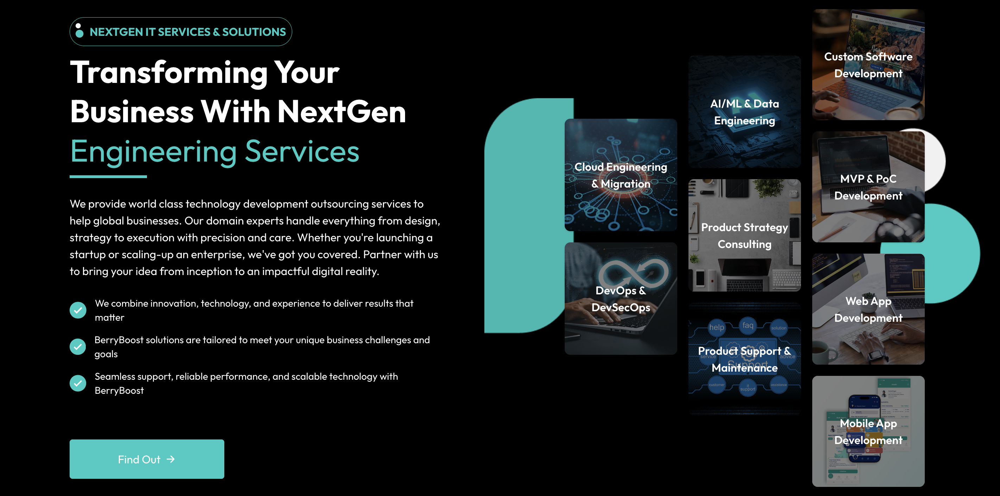
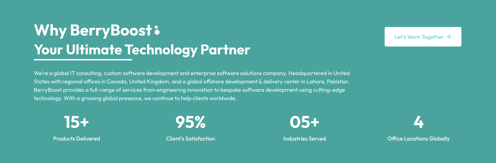
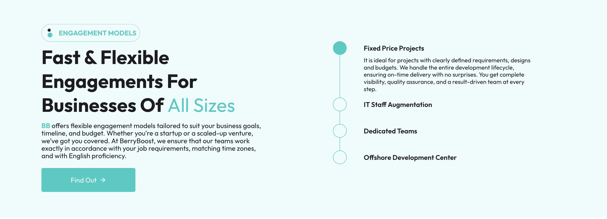
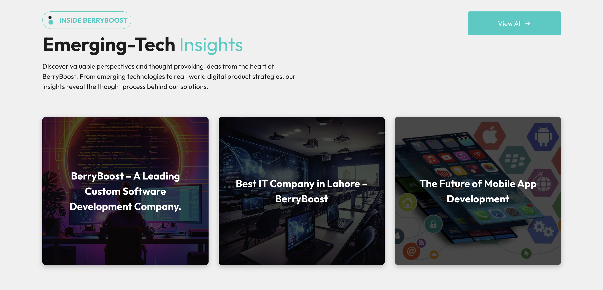
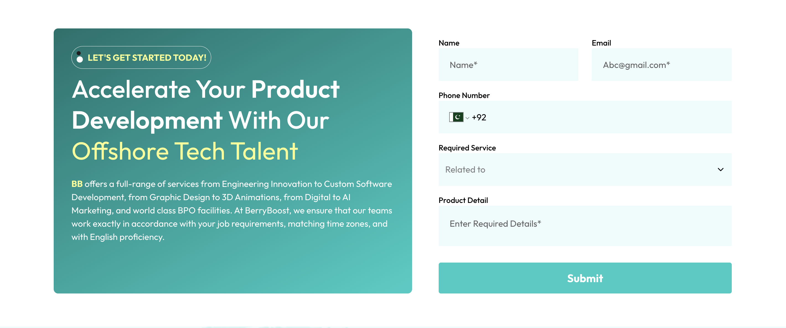
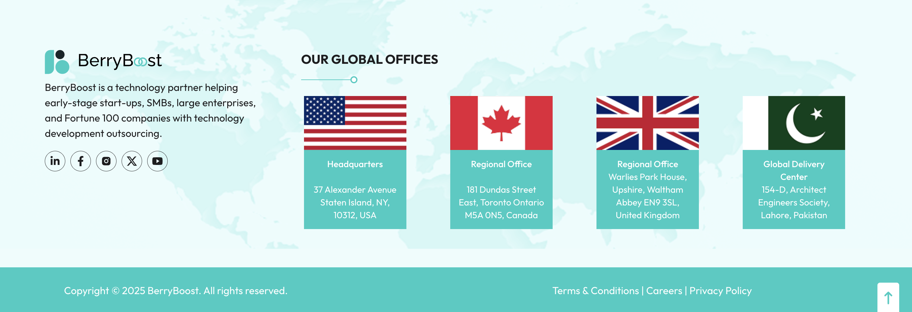

# **BerryBoost Website**

**BerryBoost** is a professional IT company website built with **Next.js**, **Node.js**, **Tailwind CSS**, and **Context API**. This project showcases a modern, responsive design for an IT company, featuring a clean UI, dynamic content, and smooth navigation.

---

## **Table of Contents**

- [Description](#description)
- [Technologies Used](#technologies-used)
- [Features](#features)
- [Installation](#installation)
- [Folder Structure](#folder-structure)
- [Screenshots](#screenshots)
- [License](#license)

---

## **Description**

BerryBoost is a responsive IT company website developed to showcase services, portfolio, and company details. With a focus on performance, the website uses **Next.js** for server-side rendering (SSR) and SEO optimization, **Tailwind CSS** for styling, and **Context API** for state management.

---

## **Technologies Used**

- **Next.js**: A powerful React framework for building static and dynamic websites with SSR support.
- **Node.js**: For the backend logic, handling API requests, and server-side operations.
- **Tailwind CSS**: A utility-first CSS framework for building custom, responsive designs efficiently.
- **Context API**: For managing global state across the app without needing external libraries like Redux.

---

## **Features**

- **Responsive Design**: Optimized for both desktop and mobile devices.
- **Dynamic Content**: Using Next.js for dynamic rendering, all the pages are highly optimized for performance.
- **Context API**: Manages global state across the website for user preferences, theme toggling, etc.
- **SEO Optimized**: Built with Next.js to ensure great SEO performance.
- **Clean and Modern UI**: Using Tailwind CSS for a custom, minimalistic look.

---

## **Installation**

To set up and run the project locally, follow these steps:

1. **Clone the repository**:

   ```bash
   git clone https://github.com/your-username/BerryBoost-Website.git
   cd BerryBoost-Website
   npm install
   npm run dev
   ```

## **Folder Structure**

- `BerryBoost-Website/`
  - `components/` # Reusable UI components (header, footer, etc.)
  - `pages/` # Next.js pages (home, about, contact, etc.)
  - `public/` # Static assets (images, fonts, etc.)
  - `styles/` # Tailwind CSS configuration and custom styles
  - `utils/` # Utility functions and hooks
  - `context/` # Context API files for global state management
  - `package.json` # Project dependencies and scripts
  - `next.config.js` # Next.js configuration

## **Screenshots**











## **License**

This project is licensed under the **MIT License** - see the [LICENSE](./LICENSE) file for details.

---

### **MIT License Summary**:

The MIT License is a permissive open-source license that allows for the following:

- **Usage**: You can use, copy, modify, merge, publish, distribute, sublicense, and/or sell copies of the Software.
- **Attribution**: You must include the original copyright notice and license text in all copies or substantial portions of the Software.
- **Warranty Disclaimer**: The software is provided "as is", without warranty of any kind, express or implied, including but not limited to the warranties of merchantability, fitness for a particular purpose, and non-infringement.

For more details, see the full license text in the [LICENSE](./LICENSE) file.

---
